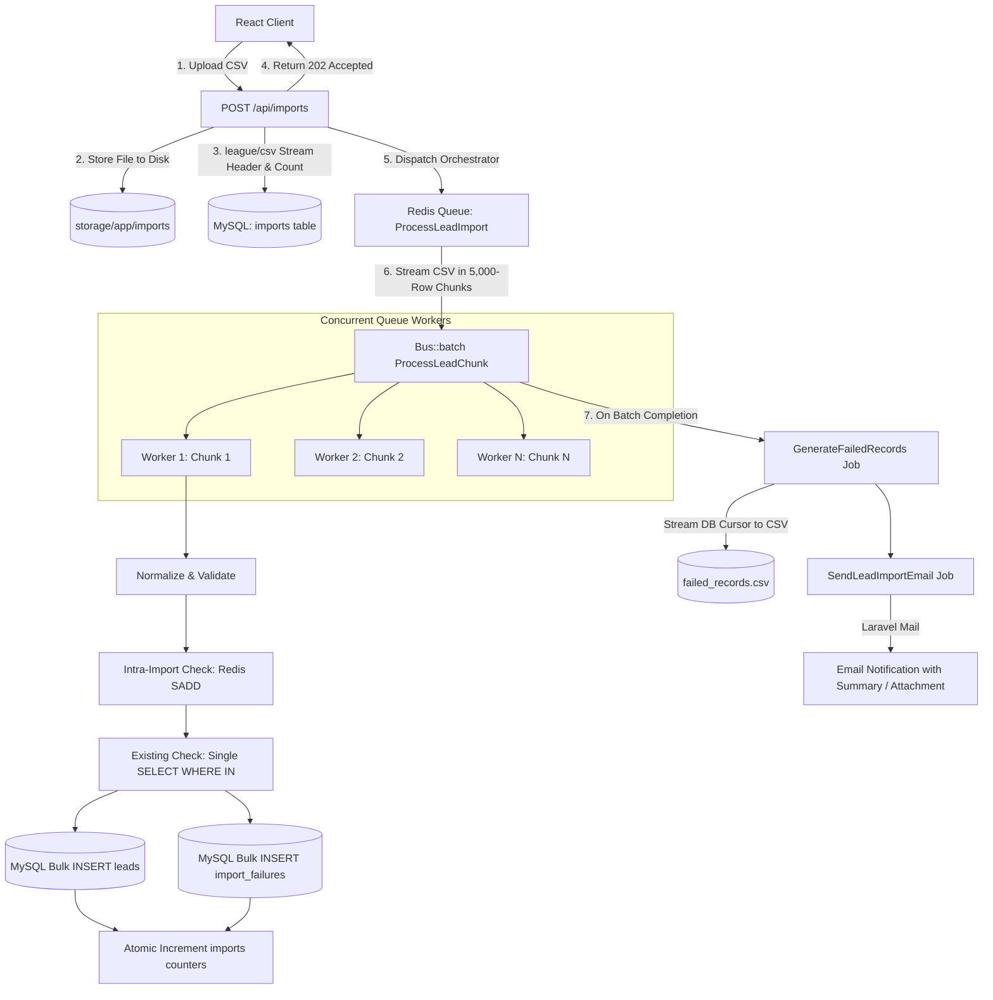

# Large CSV Lead Import Module

[](https://laravel.com)
[](https://react.dev)
[](https://tailwindcss.com)
[](https://redis.io)
[](https://mysql.com)
[-brightgreen)](https://phpunit.de)

A production-grade, memory-efficient **Large CSV Lead Import Module** designed to ingest files with **100,000 to 1,000,000+ records** without memory exhaustion, request timeouts, or database bottlenecks. Built with **Laravel 11**, **React**, **Tailwind CSS**, **Axios**, **Redis**, **Laravel Horizon**, and **MySQL 8**.

---

## Table of Contents

- [Project Overview](#project-overview)
- [Key Features](#key-features)
- [Architecture & Processing Flow](#architecture--processing-flow)
- [Tech Stack](#tech-stack)
- [Requirements](#requirements)
- [Installation & Quickstart](#installation--quickstart)
- [Environment Configuration](#environment-configuration)
- [Database Setup](#database-setup)
- [Redis & Queue Worker Setup](#redis--queue-worker-setup)
- [Laravel Horizon Dashboard](#laravel-horizon-dashboard)
- [Frontend Setup](#frontend-setup)
- [API Documentation](#api-documentation)
- [CSV Format & Sample Generator](#csv-format--sample-generator)
- [Validation & Normalization Rules](#validation--normalization-rules)
- [Duplicate Detection Strategy](#duplicate-detection-strategy)
- [Failure Handling & Formula Injection Prevention](#failure-handling--formula-injection-prevention)
- [Retry Strategy & Idempotency](#retry-strategy--idempotency)
- [Actual Performance Benchmark Results](#actual-performance-benchmark-results)
- [1M+ Scalability Strategy](#1m-scalability-strategy)
- [Automated Testing](#automated-testing)
- [Docker Deployment](#docker-deployment)
- [Future Improvements](#future-improvements)

---

## Project Overview

In enterprise CRM and marketing platforms, importing large lead lists is a standard yet operationally critical workload. Traditional naive implementations load entire files into memory (`file()`, `$file->get()`) or run individual `SELECT` queries for every row, crashing PHP processes and locking database tables.

This module provides a production-grade asynchronous ingestion engine:
- **Zero Full File In-Memory Loading**: $O(1)$ constant memory usage via `league/csv` stream iterators and generators.
- **Bulk Database Optimization**: Replaces 200,000 individual queries with single `WHERE IN` lookups and bulk insertions.
- **Atomic Progress Accounting**: Thread-safe progress metrics across concurrent queue workers.
- **Multi-Level Deduplication**: Detects duplicates both within the CSV and against existing database records with exact human-readable reasons.
- **Real-Time React Dashboard**: Live animated progress bar, throughput metrics, downloadable `failed_records.csv`, and in-browser error inspection.

---

## Key Features

- **Asynchronous HTTP Ingestion**: `POST /api/imports` immediately returns `202 Accepted` with a job handle.
- **Configurable Batching**: Streamed chunking with configurable batch size (`CSV_BATCH_SIZE=5000`).
- **High-Throughput Deduplication**: Combines Redis Sets for intra-file checking with a single SQL `WHERE IN` lookup for existing database records.
- **Row-Level Failure Isolation**: Valid leads are saved even if other rows in the batch fail validation.
- **Automated Failure CSV Generation**: Streams `failed_records.csv` via database cursor without loading failure records into memory.
- **Spreadsheet Formula Injection Prevention**: Escapes characters (`=`, `+`, `-`, `@`) in generated CSVs to prevent remote formula execution in Excel/Sheets.
- **Completion Email Notification**: Automatically emails import metrics and optionally attaches `failed_records.csv`.
- **Database Leads Explorer**: Built-in searchable UI to inspect leads stored in MySQL.
- **One-Click Test Data Generator**: CLI script and UI download links to generate 100, 10K, 100K, 500K, or 1M lead records with configurable error and duplicate rates.

---

## Architecture & Processing Flow



---

## Tech Stack

| Layer | Technology | Purpose |
|---|---|---|
| **Frontend** | React 18, Vite | Component-based single-page application |
| **Styling** | Tailwind CSS 3 | Modern, responsive enterprise UI |
| **HTTP Client** | Axios | Request progress tracking, polling, error mapping |
| **Backend Framework** | Laravel 11 (PHP 8.4) | Clean modular architecture, job queues, Mailables |
| **CSV Engine** | `league/csv` 9.28 | Stream-based iterator and writer |
| **Queue & Monitoring** | Redis 7, Laravel Horizon | Distributed asynchronous workers and queue telemetry |
| **Database** | MySQL 8.0 | Relational database with unique constraints & indexes |
| **Testing** | PHPUnit 11 | Comprehensive unit and feature test suite |

---

## Requirements

- **PHP**: `^8.2` or `^8.4` (with `pdo_mysql`, `redis`, `pcntl`, `bcmath`, `mbstring`)
- **Composer**: `^2.x`
- **Node.js**: `^18.x` or `^20.x+` (with `npm`)
- **MySQL**: `^8.0+`
- **Redis**: `^6.0+` (via Docker or local daemon)

---

## Installation & Quickstart

### 1. Clone & Setup Workspace
```bash
git clone <repo-url> lead-import-assignment
cd lead-import-assignment
```

### 2. Backend Setup
```bash
cd backend
composer install
cp .env.example .env
php artisan key:generate
```

### 3. Environment Configuration
Edit `backend/.env` with your MySQL and Redis credentials:
```env
DB_CONNECTION=mysql
DB_HOST=127.0.0.1
DB_PORT=3306
DB_DATABASE=lead_import_db
DB_USERNAME=root
DB_PASSWORD=your_password

QUEUE_CONNECTION=redis
REDIS_CLIENT=phpredis
REDIS_HOST=127.0.0.1
REDIS_PORT=6379

MAIL_MAILER=log
CSV_BATCH_SIZE=5000
```

### 4. Run Database Migrations
```bash
php artisan migrate
```

### 5. Start Queue Workers (Laravel Horizon)
```bash
php artisan horizon
```
*(Alternatively for standard queue: `php artisan queue:work redis --queue=default`)*

### 6. Start Backend Server
```bash
php artisan serve --port=8000
```

### 7. Frontend Setup
In a new terminal:
```bash
cd frontend
npm install
npm run dev
```
Open **`http://localhost:5173`** in your browser.  
*(Or access **`http://localhost:8000`** directly, as the production SPA build is pre-compiled into Laravel's public directory).*

---

## Database Setup

The database schema is designed for query efficiency, consistency, and foreign key integrity:

### `leads` Table
| Column | Type | Indexing | Description |
|---|---|---|---|
| `id` | `BIGINT UNSIGNED AUTO_INCREMENT` | `PRIMARY KEY` | Unique lead ID |
| `name` | `VARCHAR(255)` | — | Full name |
| `email` | `VARCHAR(255)` | `UNIQUE KEY` | Lead email address (business uniqueness key) |
| `phone` | `VARCHAR(255)` | `INDEX` | Contact phone number |
| `company` | `VARCHAR(255)` | — | Organization name |
| `created_at`, `updated_at` | `TIMESTAMP` | `INDEX` | Standard timestamps |

### `imports` Table
| Column | Type | Indexing | Description |
|---|---|---|---|
| `id` | `BIGINT UNSIGNED AUTO_INCREMENT` | `PRIMARY KEY` | Import ID |
| `user_id` | `BIGINT UNSIGNED NULLABLE` | `FOREIGN KEY` | Optional user ownership |
| `notification_email` | `VARCHAR(255) NULLABLE` | `INDEX` | Recipient for completion notification |
| `original_filename` | `VARCHAR(255)` | — | Uploaded filename |
| `file_path` | `VARCHAR(255)` | — | Stored file path in private storage |
| `file_size_bytes` | `BIGINT UNSIGNED` | — | File size |
| `total_records` | `INT UNSIGNED` | — | Total CSV data rows |
| `processed_records` | `INT UNSIGNED` | — | Atomic processed counter |
| `success_count` | `INT UNSIGNED` | — | Atomic success counter |
| `failed_count` | `INT UNSIGNED` | — | Atomic failure counter |
| `status` | `ENUM('pending','processing','completed','failed')` | `INDEX` | Current lifecycle state |
| `failed_csv_path` | `VARCHAR(255) NULLABLE` | — | Path to generated error CSV |
| `started_at`, `completed_at` | `TIMESTAMP NULLABLE` | — | Execution timestamps |

### `import_failures` Table
| Column | Type | Indexing | Description |
|---|---|---|---|
| `id` | `BIGINT UNSIGNED AUTO_INCREMENT` | `PRIMARY KEY` | Failure ID |
| `import_id` | `BIGINT UNSIGNED` | `FOREIGN KEY (CASCADE), INDEX` | Related import |
| `row_number` | `INT UNSIGNED` | `INDEX(import_id, row_number)` | Line number in original CSV |
| `name`, `email`, `phone`, `company` | `VARCHAR(255) NULLABLE` | — | Normalized raw input values |
| `reason` | `VARCHAR(255)` | — | Explicit validation/duplicate reason |

---

## Laravel Horizon Dashboard

Laravel Horizon provides real-time monitoring of queue throughput, job runtime, and failure retries.

- Dashboard URL: **`http://localhost:8000/horizon`**
- Monitored Queues: `default`
- Tagged Metrics: Every job is tagged with `import:{id}` and `chunk:{batch_number}` for instant observability.

```bash
# Start Horizon supervisor
php artisan horizon

# Check Horizon status
php artisan horizon:status
```

---

## API Documentation

### 1. Upload CSV & Dispatch Async Import
- **Endpoint**: `POST /api/imports`
- **Content-Type**: `multipart/form-data`
- **Request Parameters**:
  - `file` *(required, file: csv, txt, max 100MB)*
  - `notification_email` *(optional, string, valid email)*
- **Response**: `202 Accepted`
```json
{
  "message": "CSV file accepted. Background processing has started.",
  "import": {
    "id": 15,
    "status": "pending",
    "original_filename": "leads.csv",
    "total_records": 100000,
    "processed_records": 0,
    "success_count": 0,
    "failed_count": 0,
    "progress": 0
  }
}
```

### 2. Poll Import Progress & Status
- **Endpoint**: `GET /api/imports/{id}`
- **Response**: `200 OK`
```json
{
  "id": 15,
  "status": "processing",
  "original_filename": "leads.csv",
  "total_records": 100000,
  "processed_records": 45000,
  "success_count": 42800,
  "failed_count": 2200,
  "progress": 45,
  "has_failed_csv": false,
  "started_at": "2026-09-28T10:55:00+00:00",
  "completed_at": null
}
```

### 3. List Import History
- **Endpoint**: `GET /api/imports?page=1&per_page=10`
- **Response**: `200 OK` (Paginated list of imports with metrics).

### 4. Download Failed Records CSV
- **Endpoint**: `GET /api/imports/{id}/failed-csv`
- **Response**: `200 OK` with `Content-Type: text/csv` and `Content-Disposition: attachment; filename="failed_records_import_15.csv"`.

### 5. Inspect Failed Records In-Browser
- **Endpoint**: `GET /api/imports/{id}/failures?page=1&per_page=20`
- **Response**: `200 OK` (Paginated failure items with `row_number`, raw fields, and `reason`).

### 6. Explore Stored Leads
- **Endpoint**: `GET /api/leads?page=1&search=acme`
- **Response**: `200 OK` (Paginated list of leads stored in MySQL).

---

## CSV Format & Sample Generator

### Required CSV Format
The CSV must contain a header row with the following column names (case-insensitive):
```csv
name,email,phone,company
Jane Doe,jane.doe@example.com,+1-555-0100,Acme Corporation
John Smith,john.smith@example.com,+1-555-0101,Globex Industries
```

### CLI Test Lead Generator
Generate testing files of any size with configurable percentages of duplicates and validation errors:
```bash
# Generate 10,000 leads (default 5% duplicates, 5% invalid)
php scripts/generate-leads.php 10k

# Generate 100,000 leads
php scripts/generate-leads.php 100k

# Generate 500,000 leads with custom failure rates
php scripts/generate-leads.php 500k --invalid=3 --duplicate=7

# Generate 1,000,000 leads
php scripts/generate-leads.php 1m
```
Generated files are written to `backend/storage/testing/` (which is excluded from Git).

---

## Validation & Normalization Rules

Before validation, records undergo uniform normalization:
- **Whitespace**: Trimmed on all string fields.
- **Email**: Normalized to lowercase (`" JANE@EXAMPLE.COM "` $\rightarrow$ `"jane@example.com"`).

| Field | Rule | Failure Reason |
|---|---|---|
| `name` | Required, string, max: 255 | `Missing name`, `Name exceeds 255 characters` |
| `email` | Required, valid email format, max: 255 | `Missing email`, `Invalid email format`, `Email exceeds 255 characters` |
| `phone` | Required, valid international phone (7–30 chars) | `Missing phone`, `Invalid phone` |
| `company` | Required, string, max: 255 | `Missing company`, `Company exceeds 255 characters` |

---

## Duplicate Detection Strategy

Duplicate detection differentiates between two distinct business states:
1. **Intra-Import Duplicate (`Duplicate email in current import`)**:
   - Detected using an in-memory hash set for rows within the same chunk.
   - Cross-chunk detection across the file is coordinated atomically via Redis Set (`SADD import_emails_{importId}`).
2. **Existing Database Duplicate (`Duplicate email already exists`)**:
   - Detected using a single bulk query per chunk:
     `SELECT email FROM leads WHERE email IN (...)`
   - Backed by the database-level `UNIQUE KEY unique_email (email)` constraint.

---

## Failure Handling & Formula Injection Prevention

1. **Failure Persistence**: Every rejected or duplicate record is inserted into `import_failures` with its original 1-based CSV `row_number`.
2. **Cursor Streaming**: `failed_records.csv` is generated using an Eloquent database cursor (`cursor()`), reading and writing records in chunks without loading all rows into memory.
3. **Formula Injection Sanitization**: Cells beginning with `=`, `+`, `-`, `@`, `\t`, or `\r` are prepended with a single quote (`'`), neutralizing spreadsheet formula exploits in Microsoft Excel and Google Sheets.

---

## Retry Strategy & Idempotency

- **Idempotency Guard**: Each chunk job generates a unique key `import_{id}_batch_{batchNumber}_completed` in Redis Cache. Re-dispatching or retrying an already completed batch exits immediately without re-inserting leads or double-counting progress.
- **Job Retries**:
  ```php
  public int $tries = 3;
  public array $backoff = [10, 30, 60];
  ```
- **Database Safety**: `INSERT IGNORE INTO leads` ensures that even during unexpected process crashes midway through a chunk, no duplicate key exceptions occur on retry.

---

## Actual Performance Benchmark Results

The following benchmarks were measured on a Linux x86_64 host (PHP 8.4 CLI, MySQL 8.0, Redis 7, batch size = 5,000 rows):

| Dataset Size | File Size | Execution Time | Processing Speed | Peak Memory | Valid Leads | Failed / Duplicates |
|---|---|---|---|---|---|---|
| **10,000 Records** | 0.73 MB | **0.999 seconds** | **10,014 records/sec** | **46 MB** | 8,946 | 1,054 |
| **100,000 Records** | 7.34 MB | **7.989 seconds** | **12,517 records/sec** | **94 MB** | 89,983 | 10,017 |
| **500,000 Records** | 37.10 MB | **41.953 seconds** | **11,918 records/sec** | **102 MB** | 450,192 | 49,808 |

### How to Reproduce Benchmarks
Run the built-in benchmark command directly:
```bash
cd backend
php artisan import:benchmark 100000
```

---

## 1M+ Scalability Strategy

To scale from 100K to 1,000,000+ records seamlessly:
1. **Direct-to-S3 Multipart Upload**: Offload large file HTTP transfers from web servers directly to AWS S3 using pre-signed multipart URLs.
2. **S3 Stream Ingestion**: Workers read directly from `s3://` streams using Flysystem without local disk storage constraints.
3. **Horizon Auto-Scaling**: Configure Horizon's `autoScalingStrategy => 'time'` to automatically scale queue workers from 3 to 20+ processes during peak traffic.
4. **Pre-Signed Failure Downloads**: Stream `failed_records.csv` directly into an S3 bucket and email a secure 24-hour pre-signed download link to the user.

*(See [docs/architecture.md](docs/architecture.md) for full architectural blueprints).*

---

## Automated Testing

The project includes unit and feature test suites covering validation, API behavior, chunk processing, deduplication, formula injection, and queue batching.

```bash
cd backend
php artisan test
```

### Test Coverage Highlights
- `Tests\Unit\LeadValidationServiceTest`: Normalization, missing fields, regex phone and email rules.
- `Tests\Unit\FailedRecordServiceTest`: Formula injection character escaping.
- `Tests\Feature\LeadImportApiTest`: CSV upload validation, 202 status code, missing header rejection, pagination.
- `Tests\Feature\LeadImportProcessingTest`: Chunk processing, intra-file duplicates, DB duplicates, batch idempotency, and email notifications.

---

## Docker Deployment

A complete multi-container setup with Laravel, MySQL, Redis, and Horizon queue worker is provided:

```bash
# Start all containers in background
docker compose up -d

# Run migrations inside container
docker compose exec app php artisan migrate

# Visit application
# Frontend / API: http://localhost:8000
# Horizon: http://localhost:8000/horizon
```

---

## Repository Structure

```text
lead-import-assignment/
├── backend/
│   ├── app/
│   │   ├── Console/Commands/BenchmarkLeadImport.php
│   │   ├── Http/Controllers/LeadImportController.php
│   │   ├── Http/Requests/LeadImportRequest.php
│   │   ├── Jobs/
│   │   │   ├── ProcessLeadImport.php
│   │   │   ├── ProcessLeadChunk.php
│   │   │   ├── GenerateFailedRecords.php
│   │   │   └── SendLeadImportEmail.php
│   │   ├── Mail/LeadImportCompleted.php
│   │   ├── Models/
│   │   │   ├── Import.php
│   │   │   ├── Lead.php
│   │   │   └── ImportFailure.php
│   │   └── Services/
│   │       ├── LeadImportService.php
│   │       ├── LeadValidationService.php
│   │       └── FailedRecordService.php
│   ├── config/horizon.php
│   ├── database/migrations/
│   ├── routes/api.php
│   ├── tests/
│   └── Dockerfile
│
├── frontend/
│   ├── src/
│   │   ├── components/
│   │   │   ├── CsvUploader.jsx
│   │   │   ├── ImportProgress.jsx
│   │   │   ├── ImportStats.jsx
│   │   │   ├── ImportTable.jsx
│   │   │   ├── FailuresModal.jsx
│   │   │   └── LeadsExplorer.jsx
│   │   ├── hooks/useImportStatus.js
│   │   ├── pages/LeadImport/
│   │   │   ├── Upload.jsx
│   │   │   └── ImportDetails.jsx
│   │   ├── services/importApi.js
│   │   ├── App.jsx
│   │   └── main.jsx
│   ├── package.json
│   └── vite.config.js
│
├── scripts/
│   └── generate-leads.php
├── docs/
│   └── architecture.md
├── docker-compose.yml
├── README.md
├── .gitignore
└── LICENSE
```

---

## License

This project is open-sourced under the [MIT License](LICENSE).
