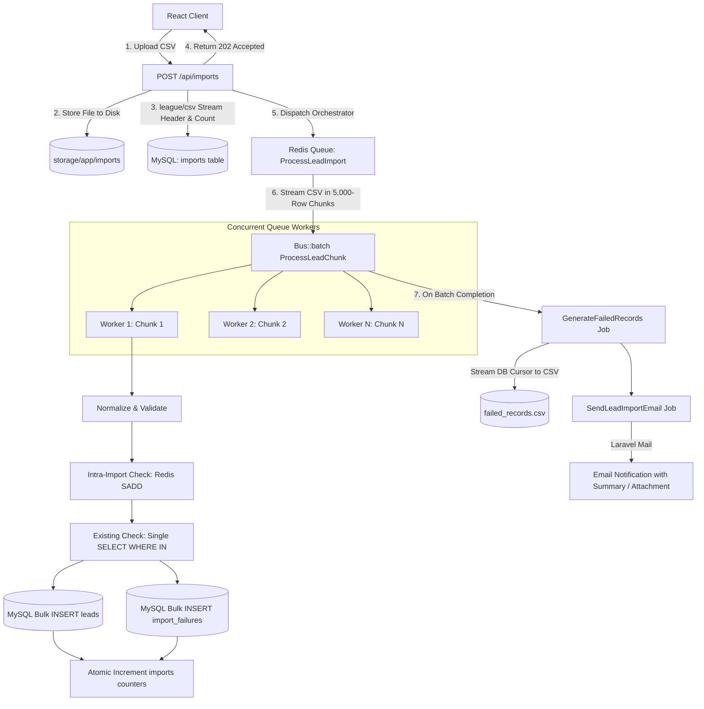

# Large CSV Lead Import Module

-brightgreen)A production-grade, memory-efficient **Large CSV Lead Import Module** designed to ingest files with **100,000 to 1,000,000+ records** without memory exhaustion, request timeouts, or database bottlenecks. Built with **Laravel 11**, **React**, **Tailwind CSS**, **Axios**, **Redis**, **Laravel Horizon**, and **MySQL 8**.

---

## Table of Contents

- [Project Overview](#project-overview)
- [Key Features](#key-features)
- [Architecture & Processing Flow](#architecture--processing-flow)
- [Tech Stack](#tech-stack)
- [Requirements](#requirements)
- [Installation & Quickstart](#installation--quickstart)
- [Environment Configuration](#environment-configuration)
- [Database Setup](#database-setup)
- [Redis & Queue Worker Setup](#redis--queue-worker-setup)
- [Laravel Horizon Dashboard](#laravel-horizon-dashboard)
- [Frontend Setup](#frontend-setup)
- [API Documentation](#api-documentation)
- [CSV Format & Sample Generator](#csv-format--sample-generator)
- [Validation & Normalization Rules](#validation--normalization-rules)
- [Duplicate Detection Strategy](#duplicate-detection-strategy)
- [Failure Handling & Formula Injection Prevention](#failure-handling--formula-injection-prevention)
- [Retry Strategy & Idempotency](#retry-strategy--idempotency)
- [Actual Performance Benchmark Results](#actual-performance-benchmark-results)
- [1M+ Scalability Strategy](#1m-scalability-strategy)
- [Automated Testing](#automated-testing)
- [Docker Deployment](#docker-deployment)
- [Future Improvements](#future-improvements)

---

## Project Overview

In enterprise CRM and marketing platforms, importing large lead lists is a standard yet operationally critical workload. Traditional naive implementations load entire files into memory (`file()`, `$file->get()`) or run individual `SELECT` queries for every row, crashing PHP processes and locking database tables.

This module provides a production-grade asynchronous ingestion engine:

- **Zero Full File In-Memory Loading**: $O(1)$ constant memory usage via `league/csv` stream iterators and generators.
- **Bulk Database Optimization**: Replaces 200,000 individual queries with single `WHERE IN` lookups and bulk insertions.
- **Atomic Progress Accounting**: Thread-safe progress metrics across concurrent queue workers.
- **Multi-Level Deduplication**: Detects duplicates both within the CSV and against existing database records with exact human-readable reasons.
- **Real-Time React Dashboard**: Live animated progress bar, throughput metrics, downloadable `failed_records.csv`, and in-browser error inspection.

---

## Key Features

- **Asynchronous HTTP Ingestion**: `POST /api/imports` immediately returns `202 Accepted` with a job handle.
- **Configurable Batching**: Streamed chunking with configurable batch size (`CSV_BATCH_SIZE=5000`).
- **High-Throughput Deduplication**: Combines Redis Sets for intra-file checking with a single SQL `WHERE IN` lookup for existing database records.
- **Row-Level Failure Isolation**: Valid leads are saved even if other rows in the batch fail validation.
- **Automated Failure CSV Generation**: Streams `failed_records.csv` via database cursor without loading failure records into memory.
- **Spreadsheet Formula Injection Prevention**: Escapes characters (`=`, `+`, `-`, `@`) in generated CSVs to prevent remote formula execution in Excel/Sheets.
- **Completion Email Notification**: Automatically emails import metrics and optionally attaches `failed_records.csv`.
- **Database Leads Explorer**: Built-in searchable UI to inspect leads stored in MySQL.
- **One-Click Test Data Generator**: CLI script and UI download links to generate 100, 10K, 100K, 500K, or 1M lead records with configurable error and duplicate rates.

---

## Architecture & Processing Flow



---

## Tech Stack

| Layer | Technology | Purpose |
| --- | --- | --- |
| **Frontend** | React 18, Vite | Component-based single-page application |
| **Styling** | Tailwind CSS 3 | Modern, responsive enterprise UI |
| **HTTP Client** | Axios | Request progress tracking, polling, error mapping |
| **Backend Framework** | Laravel 11 (PHP 8.4) | Clean modular architecture, job queues, Mailables |
| **CSV Engine** | `league/csv` 9.28 | Stream-based iterator and writer |
| **Queue & Monitoring** | Redis 7, Laravel Horizon | Distributed asynchronous workers and queue telemetry |
| **Database** | MySQL 8.0 | Relational database with unique constraints & indexes |
| **Testing** | PHPUnit 11 | Comprehensive unit and feature test suite |

---

## Requirements

- **PHP**: `^8.2` or `^8.4` (with `pdo_mysql`, `redis`, `pcntl`, `bcmath`, `mbstring`)
- **Composer**: `^2.x`
- **Node.js**: `^18.x` or `^20.x+` (with `npm`)
- **MySQL**: `^8.0+`
- **Redis**: `^6.0+` (via Docker or local daemon)

---

## Installation & Quickstart

### 1. Clone & Setup Workspace

```bash
git clone <repo-url> lead-import-assignment
cd lead-import-assignment
```

### 2. Backend Setup

```bash
cd backend
composer install
cp .env.example .env
php artisan key:generate
```

### 3. Environment Configuration

Edit `backend/.env` with your MySQL and Redis credentials:

```env
DB_CONNECTION=mysql
DB_HOST=127.0.0.1
DB_PORT=3306
DB_DATABASE=lead_import_db
DB_USERNAME=root
DB_PASSWORD=your_password

QUEUE_CONNECTION=redis
REDIS_CLIENT=phpredis
REDIS_HOST=127.0.0.1
REDIS_PORT=6379

MAIL_MAILER=log
CSV_BATCH_SIZE=5000
```

### 4. Run Database Migrations

```bash
php artisan migrate
```

### 5. Start Queue Workers (Laravel Horizon)

```bash
php artisan horizon
```

*(Alternatively for standard queue:* `php artisan queue:work redis --queue=default`*)*

### 6. Start Backend Server

```bash
php artisan serve --port=8000
```

### 7. Frontend Setup

In a new terminal:

```bash
cd frontend
npm install
npm run dev
```

Open `http://localhost:5173` in your browser.\
*(Or access* `http://localhost:8000` *directly, as the production SPA build is pre-compiled into Laravel's public directory).*

---