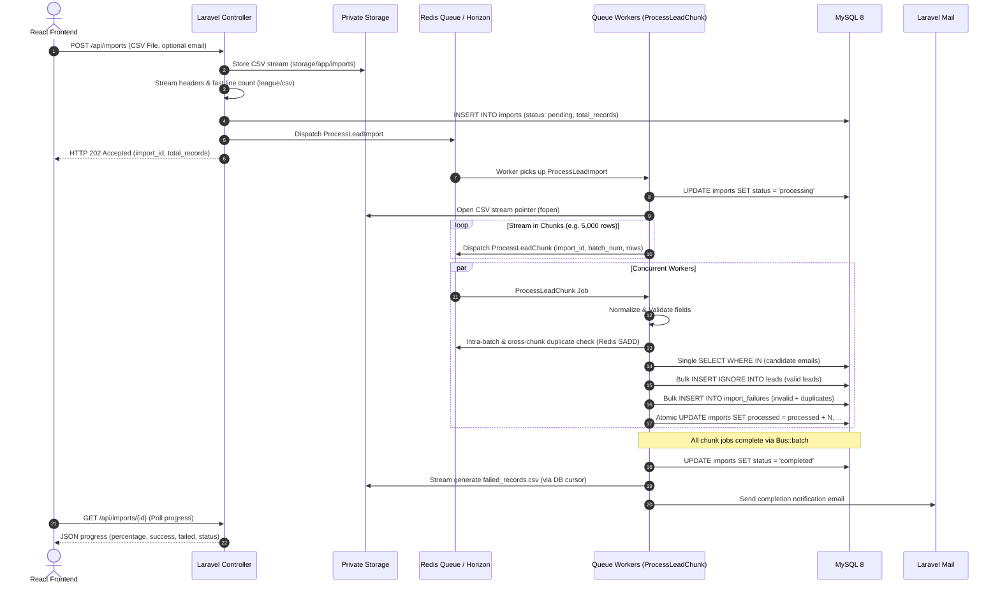
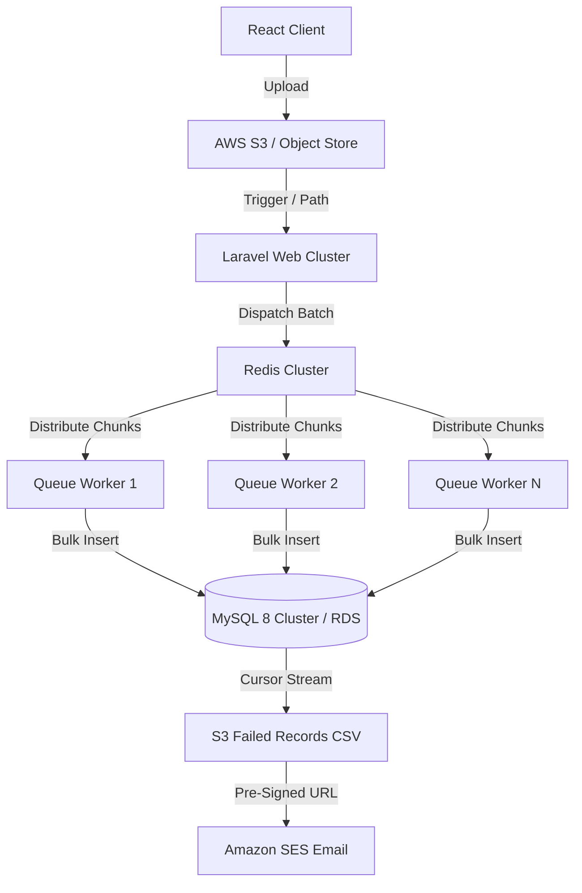

# Technical Architecture — Large CSV Lead Import Module

## 1. System Overview & Problem Statement

Ingesting large CSV files (100K to 1M+ records) in modern web applications presents four primary failure modes:
1. **Memory Exhaustion (`memory_limit` Fatal Errors)**: Loading an entire CSV into an array using `file()` or `$file->get()` consumes $O(N)$ memory, exhausting PHP process limits for files larger than a few megabytes.
2. **HTTP Timeouts (504 Gateway Timeouts)**: Synchronous processing blocks web server workers (Nginx/PHP-FPM) during validation and database execution.
3. **Database Starvation & Lock Contention**: Executing single-record `SELECT` checks and `INSERT` queries in a loop for 100K rows leads to 200K+ network round-trips, high transaction overhead, and eventual database lock timeouts.
4. **Data Corruption & Partial Ingestion**: Uncaught row errors crashing batch processes leave database tables in inconsistent states without clear visibility into failed rows.

This system resolves all four failure modes by combining:
- **Stream-based CSV parsing** with `league/csv`
- **Asynchronous, decoupled queue orchestration** backed by Redis
- **Idempotent chunk processing** with database unique constraints
- **Bulk database operations** utilizing a single `WHERE IN` lookup and bulk insertions
- **Failure isolation & streaming failure CSV generation**

---

## 2. High-Level Architecture Diagram



---

## 3. Core Architectural Principles

### 3.1 Streaming Ingestion (Constant $O(1)$ Memory Usage)
- **Zero Full In-Memory Loading**: At no point is the uploaded file loaded into PHP memory in its entirety.
- **Generator Iterators**: `league/csv` `Reader::createFromPath($path, 'r')` leverages native PHP stream wrappers (`fopen`). Rows are yielded one at a time via PHP Generators.
- **Garbage Collection Optimization**: Chunks of 5,000 rows are accumulated and handed off to queued jobs, then immediately dereferenced for cyclic garbage collection (`gc_collect_cycles()`), maintaining memory usage below 50–100MB even for millions of records.

### 3.2 High-Throughput Bulk Database Pipeline
Instead of querying row-by-row ($2N$ queries):
1. **Normalization**: Whitespace is trimmed, emails are converted to lowercase.
2. **Intra-Batch Deduplication**: In-memory hash set identifies duplicates within the same chunk.
3. **Cross-Chunk In-Flight Deduplication**: Redis Set (`SADD import_emails_{importId}`) provides atomic $O(1)$ membership checks for emails processed in previous chunks of the same file.
4. **Single Bulk Lookup Query**: A single SQL query is executed for up to 5,000 candidate emails:
   ```sql
   SELECT email FROM leads WHERE email IN ('email1@example.com', 'email2@example.com', ...);
   ```
5. **Database-Level Unique Constraint**: MySQL table `leads` enforces `UNIQUE KEY unique_email (email)`.
6. **Bulk Insertions**:
   ```sql
   INSERT IGNORE INTO leads (name, email, phone, company, created_at, updated_at) VALUES (...), (...);
   ```
   Valid leads and failure records are inserted in batches of 1,000 to respect MySQL's `max_allowed_packet`.

### 3.3 Atomic Progress Accounting
Multiple workers running concurrently never perform unsafe read-modify-write queries (`$import->processed_records += 5000`). Instead, atomic SQL updates are utilized:
```sql
UPDATE imports
SET processed_records = processed_records + 5000,
    success_count = success_count + 4800,
    failed_count = failed_count + 200
WHERE id = 123;
```
This guarantees 100% mathematical consistency without distributed locks or race conditions.

### 3.4 Idempotency & Retry Resilience
- **Batch Identity**: Each chunk job is assigned an identity: `import_{importId}_batch_{batchNumber}`.
- **Idempotency Cache Guard**: Before executing, the worker checks `Cache::has("import_{importId}_batch_{batchNumber}_completed")`. If present, the chunk terminates immediately.
- **Retry Policy**: Configured with `$tries = 3` and exponential backoff (`$backoff = [10, 30, 60]`). Transient network interruptions or database deadlocks trigger retries without duplicate record insertion.

### 3.5 Spreadsheet Formula Injection (CSV Injection) Prevention
When exporting `failed_records.csv`, unescaped strings starting with formula execution characters (`=`, `+`, `-`, `@`, `\t`, `\r`) can execute malicious commands in Microsoft Excel or Google Sheets.
The `FailedRecordService` automatically sanitizes all exported cells:
```php
if (in_array($value[0], ['=', '+', '-', '@', "\t", "\r"], true)) {
    return "'" . $value;
}
```

---

## 4. Scaling to 1M+ Records

To process 1,000,000+ records seamlessly:



1. **Direct-to-S3 / Object Store Upload**: For 100MB–1GB files, client uploads directly to S3 via pre-signed multipart URLs, offloading web server network I/O completely.
2. **S3 Stream Wrappers**: Workers open S3 stream pointers using `league/flysystem-aws-s3-v3` (`s3://bucket/key`), streaming rows without saving to local disk.
3. **Queue Horizontal Scaling**: Horizon autoscaling dynamically provisions 10–50 worker processes based on queue wait time and backlog size.
4. **Pre-Signed Failure Downloads**: Generated `failed_records.csv` is streamed directly to private S3 buckets and pre-signed temporary URLs (valid for 24 hours) are emailed to users.
